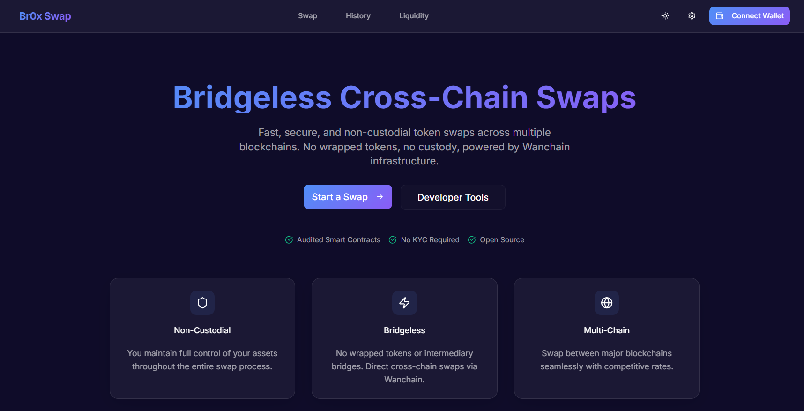

# Interface

###

### App demo

For details: Please feel free to experiment with our demo app and give us feedback!

Url: [https://br0x.vercel.app/](https://br0x.vercel.app/)

### Homepage

<figure><figcaption>
Dark mode
</figcaption></figure>

<figure><figcaption>
Light mode
</figcaption></figure>

### Swap page

<figure><figcaption></figcaption></figure>

**In-direct swap**

<figure><figcaption>
Pre-build transaction
</figcaption></figure>

<figure><figcaption></figcaption></figure>

<figure><figcaption></figcaption></figure>

### Information panel

<figure><figcaption></figcaption></figure>

