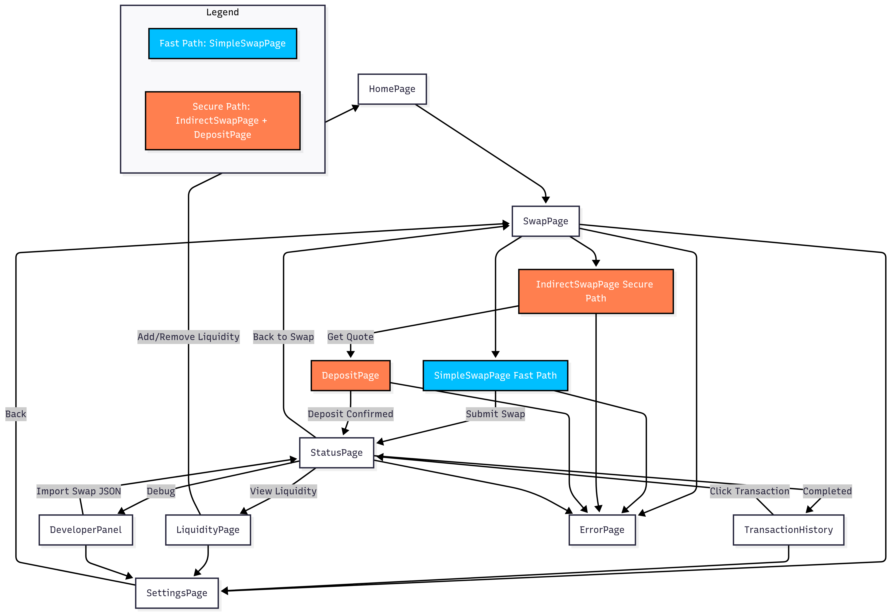
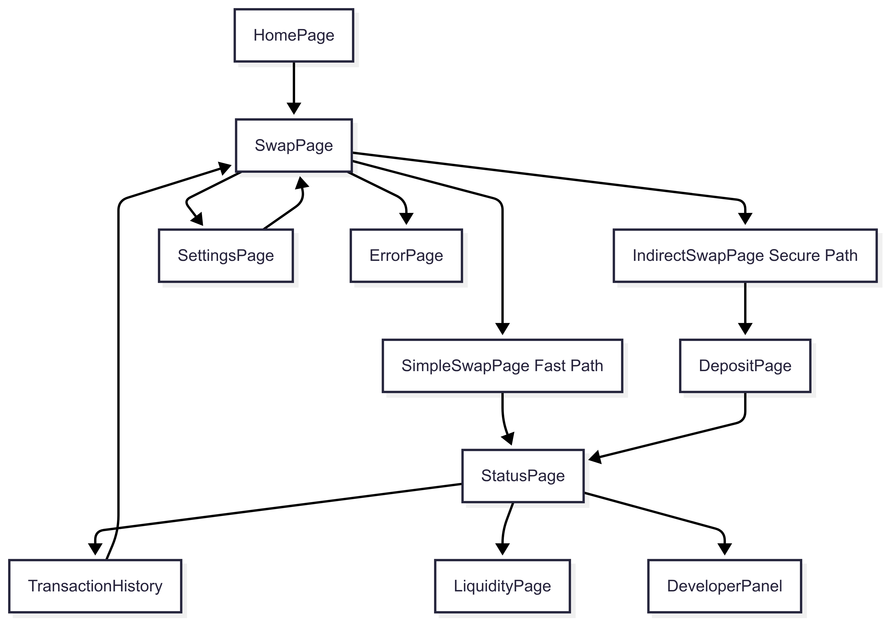
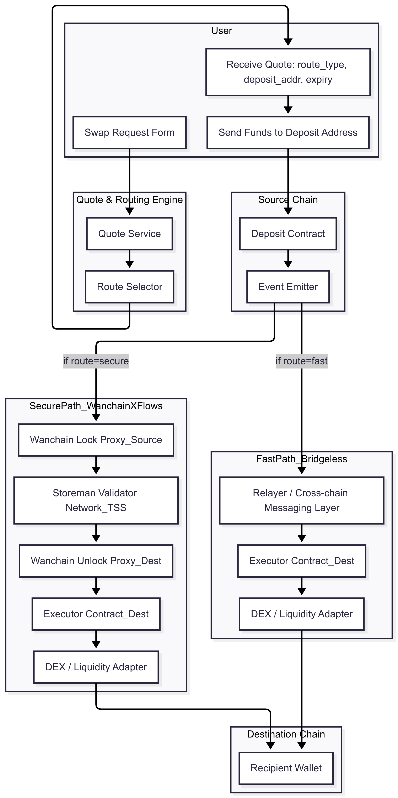
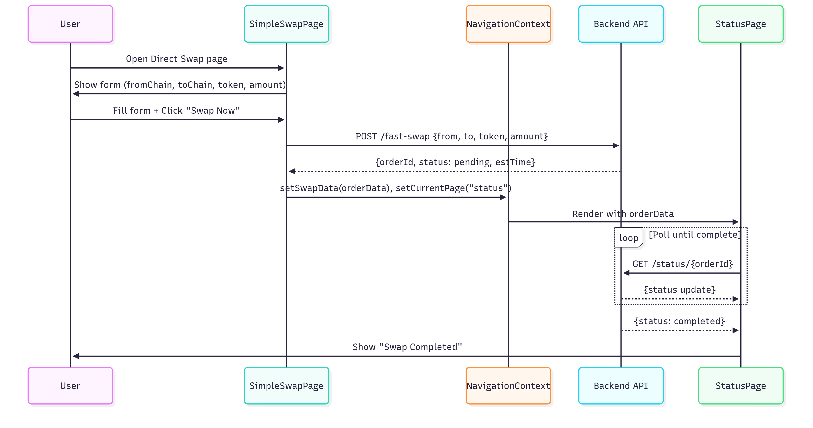
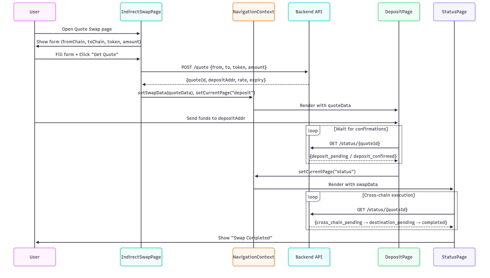
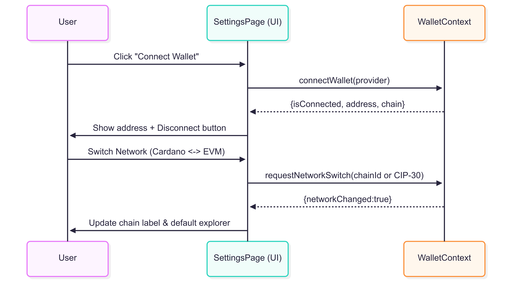
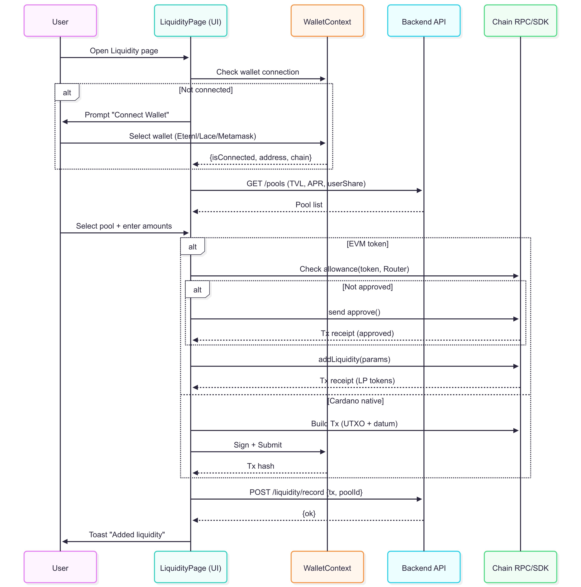

# Flow & diagram

### Overall System flow

<figure><figcaption></figcaption></figure>

<figure><figcaption></figcaption></figure>

### User swap

<figure><figcaption></figcaption></figure>

<figure><figcaption>
Direct swap diagram
</figcaption></figure>

<figure><figcaption></figcaption></figure>

### Wallet connect

<figure><figcaption></figcaption></figure>

### Liquidity page

<figure><figcaption>
Add liquidity
</figcaption></figure>

<figure><figcaption>
Remove liquidity
</figcaption></figure>

